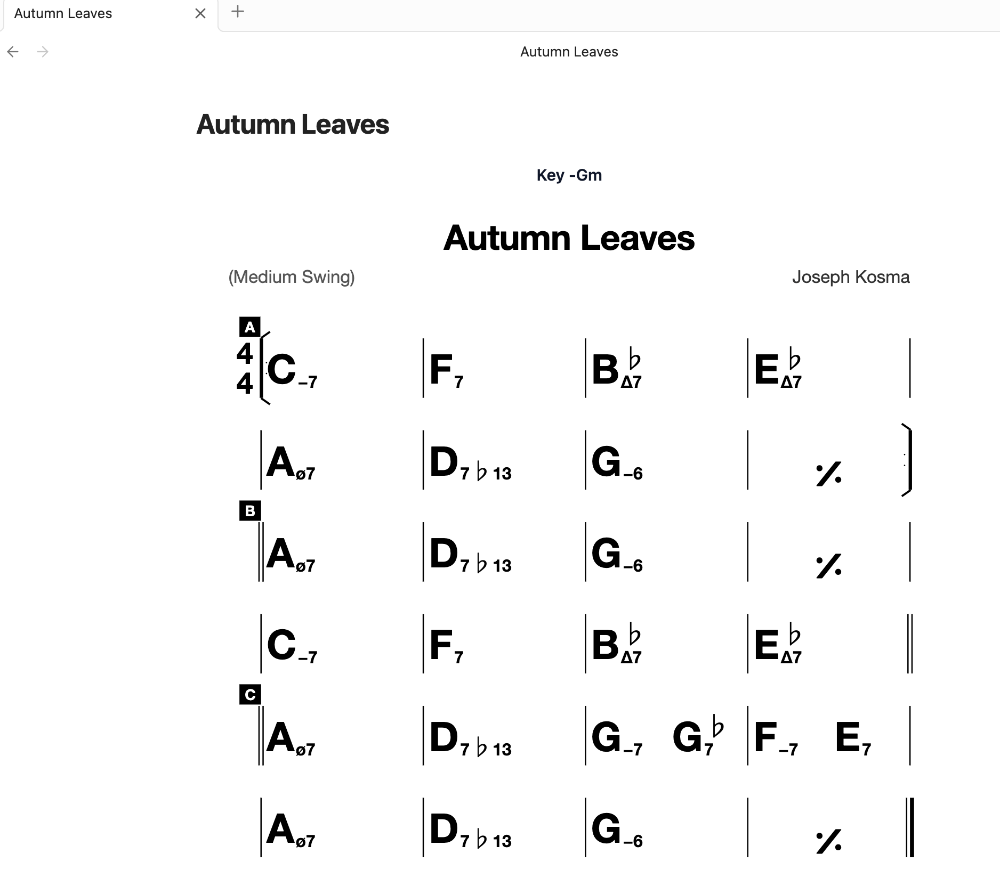

# Chord Chart

Render chord charts from iReal Pro links and simple text chord sheets inside Obsidian.



## Features

- **iReal Pro** — paste an `irealb://` URL and get a faithful paper chart. Transpose to any key in real time.
- **Chord sheets** — write charts in plain text (one chord per bar, spaces separate bars)
- **Dark mode** — paper adapts to your Obsidian theme
- **Fullscreen** — expand any chart to fullscreen with fill/fit/1:1 modes
- **.ireal files** — open as rendered chart with pencil toggle for live cell-grid editor
- **.chart files** — open as rendered viewer
- **In-place editing** — edit iReal code blocks directly in markdown, changes persist to file
- **Create from clipboard** — create new charts from iReal Pro links copied to clipboard
- **BRAT** — install via [BRAT](https://github.com/TfTHacker/obsidian42-brat) with `leviyehonatan/obsidian-chord-chart`

## Install

**BRAT** (recommended): add `leviyehonatan/obsidian-chord-chart` in [BRAT](https://github.com/TfTHacker/obsidian42-brat) for auto-updates.

**Manual:** download the four files from the [repository](https://github.com/leviyehonatan/obsidian-chord-chart) (`main.js`, `manifest.json`, `styles.css`, `versions.json`) into `.obsidian/plugins/chord-chart/`.

## Usage

### iReal Pro charts

Copy an `irealb://` URL from the iReal Pro app or online forums:

````markdown
```chart-ireal
irealb://Autumn%20Leaves=Kosma%20Joseph==Medium%20Swing=G%2D==1r34LbKcu7...
```
````

- Click **⛶** (top-left) for fullscreen with fill/fit/1:1 modes
- Click **Edit** (top-left) to open the live cell-grid editor
- Changes persist to the code block when you click **Done**
- **Paste iReal from clipboard** — Cmd+P or right-click in editor to insert a code block

### Chord sheets

Write charts in a simple text format:

````markdown
```chart
= Verse
C Am F G
C Am F G

= Chorus
Am F C G
Am F G C
```
````

**Format rules:**
- One chord = one bar, spaces separate bars
- `_` splits a bar — `Dm7_G7` = two chords in one bar
- `:` section title · `=` section with double barline
- `-` text annotation · `1.` / `2.` volta endings
- `D.C.` da capo · `O` coda sign · `#` comments

### File types

Open `.chart` and `.ireal` files natively in Obsidian:

| File | Opens as | Toggle |
|------|----------|--------|
| `.ireal` | Chart viewer | ✏️ → Cell-grid editor → Cmd+S saves |
| `.chart` | Chart viewer | — |

### Creating new charts

| Method | Options |
|--------|---------|
| **Cmd+P** → "Create new iReal chart" | Empty or from clipboard → `.ireal` or markdown |
| **Cmd+P** → "Create new chart file" | Blank `.chart` file |
| **Right-click file explorer** | New iReal from clipboard / New blank iReal / New blank chart |
| **Cmd+P / right-click editor** → "Paste iReal chart" | Inserts ````chart-ireal` code block at cursor |

Files are auto-named from the song title (e.g. `Blue Bossa.ireal`, `Blue Bossa 1.ireal` if duplicate).

### Keyboard shortcuts

Assign hotkeys in Obsidian Settings → Hotkeys:
- **Toggle edit/view (Chord Chart)** — switch between viewer and editor for `.ireal` files
- **Paste iReal chart from clipboard** — insert code block at cursor
- **Create new iReal chart** — open creation dialog
- **Create new chart file** — blank `.chart` file

## License

All rights reserved.
